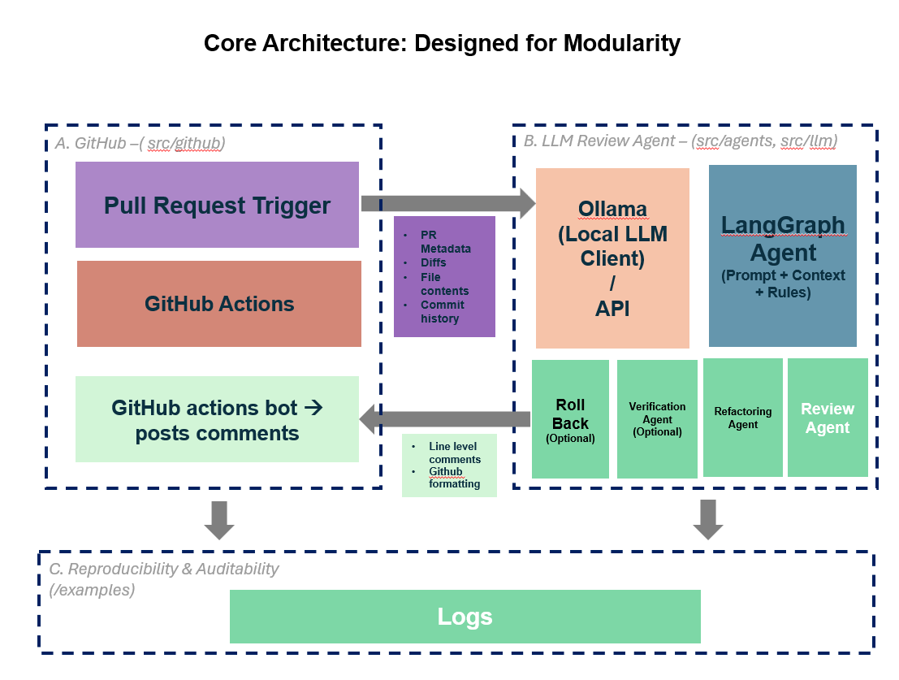
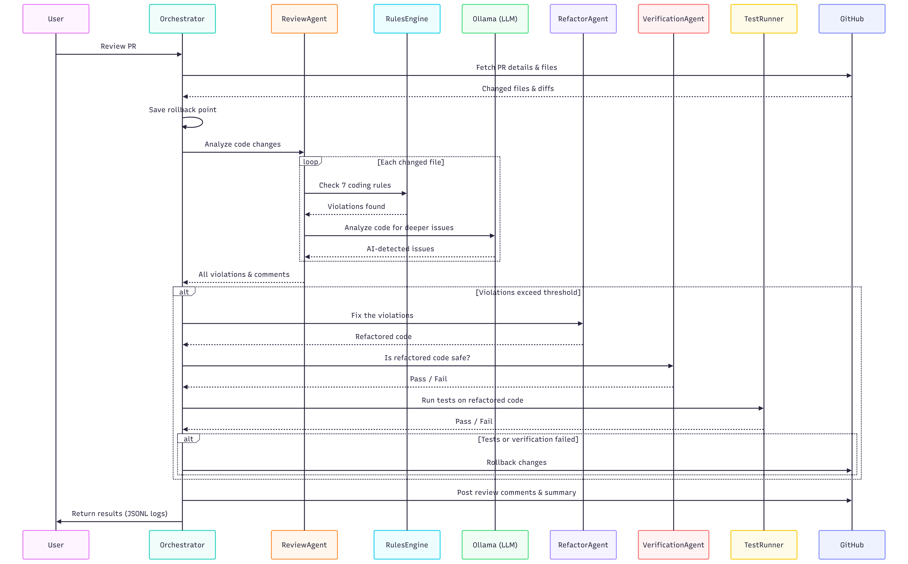

# AI Code Review Agent

An intelligent, automated code review system that integrates with GitHub's pull request workflow. This agent autonomously analyzes code changes, provides meaningful feedback, and can delegate to a refactoring agent to apply improvements.

## Features

- **GitHub Integration**: Automatically triggers on PR open/update via GitHub Actions
- **Multi-Rule Static Analysis**: 7 configurable rules across Style, Quality, Security, and Best Practices
- **LLM-Powered Analysis**: Uses Ollama with CodeLlama for semantic code understanding
- **Multi-Agent Architecture**: LangGraph orchestrator with Review and Refactor agents
- **Automated Fixes**: Refactoring agent can apply and commit fixes
- **Reproducible Results**: JSONL logging for auditability

## Architecture

### Sequence Diagram

## Quick Start

### Prerequisites

- Python 3.11+
- [uv](https://docs.astral.sh/uv/) (recommended) or pip for package management
- GitHub account with API access
- [Ollama](https://ollama.com/) (optional, for LLM features)

### Installation

1. **Clone the repository**
   ```bash
   git clone https://github.com/your-org/git-agent.git
   cd git-agent
   ```

2. **Set up environment with uv (recommended)**
   ```bash
   # Install uv if you don't have it
   curl -LsSf https://astral.sh/uv/install.sh | sh

   # Create virtual environment and install dependencies
   uv venv
   source .venv/bin/activate  # On Windows: .venv\Scripts\activate
   uv pip install -r requirements.txt
   ```

   **Alternative: using pip**
   ```bash
   python -m venv .venv
   source .venv/bin/activate
   pip install -r requirements.txt
   ```

3. **Set up environment variables**
   ```bash
   export GITHUB_TOKEN="ghp_your_token_here"
   export GITHUB_REPOSITORY="owner/repo"
   ```

4. **Install Ollama (optional)**
   ```bash
   # macOS/Linux
   curl -fsSL https://ollama.com/install.sh | sh
   ollama pull codellama:7b
   ```

### Usage

#### Command Line

```bash
# Review a specific PR
python -m src.main --pr 42 --repo owner/repo

# Static analysis only (no LLM)
python -m src.main --pr 42 --repo owner/repo --no-llm

# Dry run (don't post comments)
python -m src.main --pr 42 --repo owner/repo --no-post

# Custom config
python -m src.main --pr 42 --config path/to/coding_standards.yaml
```

#### GitHub Actions

The agent automatically runs on PR events. Just push this repo to GitHub and open a PR!

```yaml
# .github/workflows/code_review.yml is already configured
# It triggers on: pull_request [opened, synchronize, reopened]
```

## Configuration

### Coding Standards (`config/coding_standards.yaml`)

```yaml
rules:
  # Style & Formatting
  - id: S001
    name: line_length
    category: style
    severity: warning
    config:
      max_length: 120

  # Code Quality
  - id: Q001
    name: function_complexity
    category: quality
    severity: error
    config:
      max_cyclomatic_complexity: 10

  # Security
  - id: SEC001
    name: hardcoded_secrets
    category: security
    severity: critical
    config:
      patterns:
        - "password\\s*=\\s*['\"][^'\"]+['\"]"
        - "api_key\\s*=\\s*['\"][^'\"]+['\"]"

  # Best Practices
  - id: BP001
    name: error_handling
    category: best_practices
    severity: warning
    config:
      checks:
        bare_except: true

# Delegation thresholds
delegation:
  enabled: true
  criteria:
    cyclomatic_complexity_threshold: 10
    violations_per_file_threshold: 3
    critical_violation_auto_delegate: true
```

### Environment Variables

| Variable | Description | Required |
|----------|-------------|----------|
| `GITHUB_TOKEN` | GitHub personal access token | Yes |
| `GITHUB_REPOSITORY` | Repository in `owner/repo` format | Yes |
| `PR_NUMBER` | Pull request number | Yes (or via `--pr`) |
| `OLLAMA_HOST` | Ollama server URL | No (default: `http://localhost:11434`) |
| `OLLAMA_MODEL` | Ollama model name | No (default: `codellama:7b`) |
| `LOG_LEVEL` | Logging level | No (default: `INFO`) |

## Coding Rules

| ID | Name | Category | Severity | Description |
|----|------|----------|----------|-------------|
| S001 | line_length | Style | Warning | Lines should not exceed 120 characters |
| S002 | naming_conventions | Style | Warning | Identifiers should follow naming conventions |
| Q001 | function_complexity | Quality | Error | Functions should have low cyclomatic complexity |
| Q002 | function_length | Quality | Warning | Functions should not exceed 50 lines |
| SEC001 | hardcoded_secrets | Security | Critical | No hardcoded passwords/API keys |
| SEC002 | sql_injection | Security | Critical | SQL queries should use parameterized statements |
| BP001 | error_handling | Best Practices | Warning | Proper exception handling |

## Multi-Agent Delegation

The review agent delegates to the refactoring agent when:

| Criteria | Threshold |
|----------|-----------|
| Cyclomatic complexity | > 10 |
| Violations per file | >= 3 |
| Critical severity | Any |
| Function length | > 50 lines |

## Output Format

Review results are logged in JSONL format:

```json
{"timestamp": "2026-02-13T10:30:00Z", "event": "review_started", "pr": 42}
{"timestamp": "2026-02-13T10:30:01Z", "event": "rule_triggered", "rule_id": "Q001", "file": "src/utils.py", "line": 15, "severity": "error", "confidence": 0.95}
{"timestamp": "2026-02-13T10:30:02Z", "event": "delegation", "reason": "high_complexity", "target": "refactor_agent"}
{"timestamp": "2026-02-13T10:30:05Z", "event": "review_completed", "total_violations": 3, "comments_posted": 3}
```

## Project Structure

```
git-agent/
├── .github/workflows/
│   └── code_review.yml      # GitHub Actions workflow
├── src/
│   ├── main.py              # Entry point
│   ├── agents/
│   │   ├── orchestrator.py  # LangGraph state machine
│   │   ├── review_agent.py  # Code review agent
│   │   └── refactor_agent.py # Refactoring agent
│   ├── analysis/
│   │   ├── diff_parser.py   # Parse GitHub diffs
│   │   └── rules_engine.py  # Apply coding standards
│   ├── github/
│   │   ├── client.py        # GitHub API wrapper
│   │   └── models.py        # Data models
│   └── llm/
│       └── ollama_client.py # Ollama integration
├── config/
│   └── coding_standards.yaml
├── examples/
│   └── sample_review_output.jsonl
├── tests/
├── requirements.txt
└── README.md
```

## Development

### Running Tests

```bash
pytest tests/ -v
```

### Adding New Rules

1. Create a new rule class in `src/analysis/rules_engine.py`:

```python
class MyNewRule(Rule):
    def check(self, filename, content, parsed_diff):
        violations = []
        # Your logic here
        return violations
```

2. Register it in `RULE_CLASSES`:

```python
RULE_CLASSES = {
    ...
    "my_new_rule": MyNewRule,
}
```

3. Add configuration in `config/coding_standards.yaml`

## Known Limitations

- Tree-sitter AST analysis not yet implemented (on roadmap)
- Refactoring agent has limited automatic fix capabilities
- LLM analysis requires local Ollama server

## Future Improvements

- [ ] Tree-sitter integration for proper AST parsing
- [ ] More sophisticated refactoring (extract method, simplify conditionals)
- [ ] Test coverage analysis integration
- [ ] Custom rule plugins
- [ ] Web dashboard for review history

## License

MIT License - See [LICENSE](LICENSE) for details.
